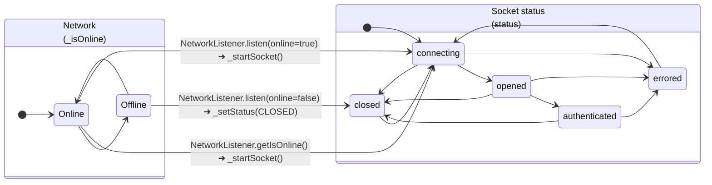
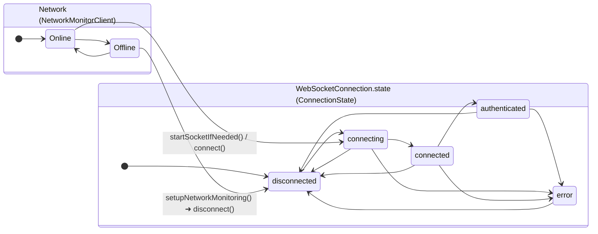
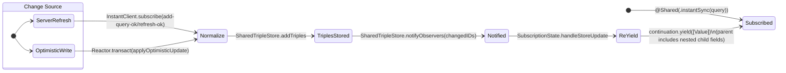

# Offline Mode Design (JS Parity + Swift Implementation)

HOW:
  Read this doc first, then run the integration tests:
  - InstantDB iOS SDK: `INSTANT_RUN_EPHEMERAL_INTEGRATION_TESTS=1 swift test -c debug --filter OfflineModeIntegrationTests`
  - SharingInstant:    `INSTANT_RUN_EPHEMERAL_INTEGRATION_TESTS=1 swift test -c debug --filter SharingInstantOfflineModeIntegrationTests`

  [Inputs]
  - NetworkMonitorClient: Controls online/offline simulation in tests.
  - enableLocalPersistence: Must be enabled for true offline support (query cache + pending mutations).

  [Outputs]
  - Deterministic offline/online integration test coverage.

  [Side Effects]
  - Creates ephemeral apps and writes/cleans up test data.

WHO:
  Team / Agents
  (Context: Align SharingInstant + InstantDB Swift with InstantDB JS core offline semantics.)

WHAT:
  A specification for how offline mode should behave in InstantDB’s client stack:
  - JS core (`client/packages/core/src/Reactor.js`)
  - JS React wrappers (`@instantdb/react`)
  - JS Admin SDK (`@instantdb/admin`)
  - Swift InstantDB iOS SDK (`instant-ios-sdk`)
  - SharingInstant (`sharing-instant`)

WHEN:
  2025-12-31
  Last Modified: 2026-01-02

WHERE:
  instantdb/sharing-instant/docs/OFFLINE_MODE_DESIGN.md

WHY:
  Offline mode is subtle because it crosses:
  - connection lifecycle (online/offline detection + reconnection)
  - persistence (cached query results + queued writes)
  - optimistic UI (local writes visible immediately)
  - conflict resolution (server is source-of-truth, LWW semantics)

  Without a crisp spec, “works in simple tests” but fails in real apps (typing, speech, rapid updates).

---

## 1) Big Picture: What “Offline Mode” Means Here

Offline mode is **local-first UX** with eventual consistency:

1. **Reads** should keep working “reasonably”:
   - Subscriptions can show cached results while offline.
   - `queryOnce` should *not* pretend cached data is fresh; it fails when offline.

2. **Writes** should keep working:
   - Writes are applied optimistically to local state immediately.
   - Writes are persisted locally if local persistence is enabled.
   - When connectivity returns, queued writes are replayed to the server.

3. **Conflicts** are resolved deterministically:
   - InstantDB uses **Last-Write-Wins (LWW)** on a per-field basis (implemented as per-triple timestamps).
   - If two writers update the same field, whichever mutation is applied later (higher timestamp) wins.
   - If two writers update different fields, those updates should *merge* naturally.

The “merge vs clobber” behavior depends heavily on whether updates are sent as:
- **Patch / diff-only** updates (only changed fields) ✅
- **Full-entity snapshot** updates (includes stale values) ❌ under concurrency/offline

---

## 2) Canonical Reference: JS Core (Reactor.js)

Source-of-truth: `instant/client/packages/core/src/Reactor.js`

> Note: Line numbers in this doc are best-effort pointers. Prefer the referenced symbol names and
> search within the file if the code has moved.

### 2.1 Online/offline tracking

- JS core tracks `_isOnline`.
- When the network transitions:
  - Online → start socket (`_startSocket()`).
  - Offline → set connection status to `CLOSED` (`_setStatus(STATUS.CLOSED)`).

Important: JS core avoids wasting resources while offline by **skipping reconnection attempts**.

### 2.1.1 JS state diagram (online/offline + socket status)

This diagram is intentionally simplified, but it captures the part we care about for offline parity:

JS code pointers:
- Network listener wiring: `instant/client/packages/core/src/Reactor.js` lines 353–377.
- Status constants: `instant/client/packages/core/src/Reactor.js` lines 42–48.
- Socket open → send init + set OPENED: `instant/client/packages/core/src/Reactor.js` lines 1529–1556.
- `init-ok` → set AUTHENTICATED + flush pending: `instant/client/packages/core/src/Reactor.js` lines 563–567.
- Close → set CLOSED + schedule reconnect (unless shutdown): `instant/client/packages/core/src/Reactor.js` lines 1626–1658.
- Reconnect backoff skips offline: `instant/client/packages/core/src/Reactor.js` lines 1602–1623.

### 2.2 Reads

- **Subscriptions (`subscribe`)**
  - May emit cached results immediately (offline-friendly).
  - When storage loads `pendingMutations`, it triggers `notifyAll` so the UI can reflect local writes.

- **`queryOnce`**
  - If offline, JS rejects immediately:
    - “We can’t run `queryOnce`, because the device is offline.”
  - This is intentionally strict: `queryOnce` is for *fresh* reads.

### 2.3 Writes

- `pushTx` / `pushOps`:
  - Creates a pending mutation record (with `tx-steps`) and persists it.
  - If not authenticated → mark as “enqueued”.
  - If offline → mark as “enqueued” and **do not schedule a timeout**.
  - If online + authenticated → send and schedule a timeout.

- On reconnect/authentication:
  - `_flushPendingMessages()` replays pending mutations in a deterministic order.

### 2.3.1 JS mutation lifecycle diagram (pending mutations)

This diagram focuses on **one mutation** and how it moves through JS core’s offline queue.

Key nuance: JS can “resolve” the mutation promise as `enqueued` even though the mutation still
exists in the durable `pendingMutations` map and will be replayed later.

```mermaid
stateDiagram-v2
  direction LR

  [*] --> Created: pushTx / pushOps

  Created --> Persisted: _updatePendingMutations()\n(kv.pendingMutations.set)

  Persisted --> Enqueued: if status !== AUTHENTICATED\n_finishTransaction('enqueued')
  Persisted --> Enqueued: if !_isOnline\n_finishTransaction('enqueued')

  Persisted --> InFlight: if AUTHENTICATED && _isOnline\n_trySend(eventId, mutation)\n+ schedule timeout

  Enqueued --> InFlight: init-ok ➜ _flushPendingMessages()\n(or later _sendMutation)

  InFlight --> Confirmed: 'transact-ok'\n(tx-id assigned + confirmed timestamp)\n_finishTransaction('synced')

  InFlight --> Errored: server 'error'\n_handleMutationError('error')
  InFlight --> Errored: timeout (while online)\n_handleMutationError('timeout')

  Confirmed --> CleanedUp: _cleanupPendingMutationsQueries()\n(processed-tx-id advanced)\nOR _cleanupPendingMutationsTimeout()

  Errored --> CleanedUp: pending mutation removed\n(+ promise rejected)
```

JS code pointers:
- Create + persist pending mutation:
  - `instant/client/packages/core/src/Reactor.js` lines 1320–1366 (`pushTx` / `pushOps`).
- Decide whether to enqueue vs send (and schedule timeout only if online):
  - `instant/client/packages/core/src/Reactor.js` lines 1385–1421 (`_sendMutation`).
- Replay queued mutations after reconnect/auth:
  - `instant/client/packages/core/src/Reactor.js` lines 563–567 (`init-ok`) and 1428–1456 (`_flushPendingMessages`).
- Mark confirmed:
  - `instant/client/packages/core/src/Reactor.js` lines 716–755 (`transact-ok`).
- Error/remove:
  - `instant/client/packages/core/src/Reactor.js` lines 834–852 (`_handleMutationError`) and 854–900 (`_handleReceiveError`).
- Cleanup confirmed mutations:
  - `instant/client/packages/core/src/Reactor.js` lines 1459–1476 (`_cleanupPendingMutationsQueries`) and 1483–1500 (`_cleanupPendingMutationsTimeout`).

### 2.4 Admin SDK (`@instantdb/admin`) note

The JavaScript Admin SDK is a **server-to-server** client. It does not implement “offline mode”
in the same sense as the browser/mobile clients because:

- It does not maintain a long-lived WebSocket connection.
- It does not persist a local query cache.
- It does not queue mutations for later replay.

If the network is unavailable, Admin SDK calls fail immediately (like a normal HTTP client).

We still treat it as a useful **ground truth** in tests and debugging because it bypasses
client-side caching, optimistic writes, and reconnection behavior.

---

## 3) Swift Architecture: How It Maps

There are two Swift layers that matter:

### 3.1 InstantDB iOS SDK (`instant-ios-sdk`)

Responsibilities:
- WebSocket connection lifecycle and online status tracking.
- Local persistence (SQLite/GRDB):
  - cached query results (`query_subs`)
  - schema attrs
  - pending mutations
- Local-first mutation API:
  - `transactLocalFirst(...)` persists mutations and sends them when authenticated.
  - `flushPendingMutations()` replays queued writes after reconnect.

### 3.2 SharingInstant (`sharing-instant`)

Responsibilities:
- `@Shared(.instantSync(...))` — the app-facing sync primitive.
- A shared normalized cache (TripleStore) that powers SwiftUI updates.
- Explicit mutation helpers (create/update/link/unlink) that send transactions via `Reactor.transact(...)`.

SharingInstant relies on the InstantDB iOS SDK for:
- durable persistence
- offline queueing + replay
- cached subscriptions

### 3.3 Swift state diagram (online/offline + connection state)

The Swift stack has the same two “dimensions” as JS core:
- `isOnline` (from the injected `NetworkMonitorClient`)
- `connectionState` / `state` (WebSocket lifecycle)

Swift code pointers:
- `InstantClient` injects a `NetworkMonitorClient` into `WebSocketConnection`:
  - `instant-ios-sdk/Sources/InstantDB/Core/InstantClient.swift` lines 87–105.
- Network listener parity with JS core:
  - `instant-ios-sdk/Sources/InstantDB/Network/WebSocketConnection.swift` lines 148–221.
- Offline transition closes the socket + cancels reconnect:
  - `instant-ios-sdk/Sources/InstantDB/Network/WebSocketConnection.swift` lines 192–218.
- Reconnect backoff skips offline:
  - `instant-ios-sdk/Sources/InstantDB/Network/WebSocketConnection.swift` lines 303–340.
- `connect()` refuses to start a socket while offline:
  - `instant-ios-sdk/Sources/InstantDB/Network/WebSocketConnection.swift` lines 243–265.
- `init-ok` processing flushes active queries + pending mutations:
  - `instant-ios-sdk/Sources/InstantDB/Core/InstantClient.swift` lines 370–452.

Implementation note:
- Swift delivers server messages on the main queue (and sets `state = .authenticated` before
  delivering `init-ok`) to preserve JS ordering without using `DispatchQueue.main.sync` (which
  can trigger Swift concurrency runtime warnings).

### 3.4 Swift mutation lifecycle diagram (pending mutations)

Swift models the same durable queue (pending mutations persisted to SQLite), but the API shape is
slightly different:

- JS returns a promise that may resolve “enqueued” even while offline.
- Swift’s `transactLocalFirst` returns the `eventId` immediately and relies on:
  - local optimistic UI (SharingInstant triple store), and
  - server `transact-ok` + refresh broadcasts to converge.

```mermaid
stateDiagram-v2
  direction LR

  [*] --> Created: transactLocalFirst(txSteps)\n(eventId generated)

  Created --> Persisted: LocalStorage.savePendingMutation()

  Persisted --> Enqueued: if connectionState != authenticated\ntrySendPendingMutation returns early

  Persisted --> InFlight: if authenticated\nWebSocketConnection.send(transact)\n(inFlightMutationEventIds.insert)

  Enqueued --> InFlight: init-ok ➜ flushPendingMutations()\n(trySendPendingMutation for each)

  InFlight --> Confirmed: 'transact-ok'\nmarkPendingMutationConfirmed(eventId, txId)

  InFlight --> Errored: server 'error'\nmarkPendingMutationErrored(eventId, error)

  Confirmed --> CleanedUp: refresh-ok 'processed-tx-id'\ncleanupProcessedMutations(processedTxId)

  Errored --> CleanedUp: (implementation-defined)\nmay be retained for debugging or deleted later
```

Swift code pointers:
- Create + persist pending mutation:
  - `instant-ios-sdk/Sources/InstantDB/Core/InstantClient.swift` lines 1475–1521 (`transactLocalFirst`).
  - `instant-ios-sdk/Sources/InstantDB/LocalStorage/LocalStorage.swift` lines 264–314 (`savePendingMutation`).
- Attempt send when authenticated:
  - `instant-ios-sdk/Sources/InstantDB/Core/InstantClient.swift` lines 1213–1260 (`trySendPendingMutation`).
- Flush queued mutations after reconnect/auth:
  - `instant-ios-sdk/Sources/InstantDB/Core/InstantClient.swift` lines 370–452 (`handleInitOk` calling `flushPendingMutations`).
  - `instant-ios-sdk/Sources/InstantDB/Core/InstantClient.swift` lines 1183–1204 (`flushPendingMutations`).
- Mark confirmed / errored:
  - `instant-ios-sdk/Sources/InstantDB/Core/InstantClient.swift` lines 604–629 (`handleTransactOk`).
  - `instant-ios-sdk/Sources/InstantDB/Core/InstantClient.swift` lines 694–721 (`handleError`).
  - `instant-ios-sdk/Sources/InstantDB/LocalStorage/LocalStorage.swift` lines 317–348 (`markPendingMutationConfirmed` / `markPendingMutationErrored`).
- Cleanup confirmed mutations:
  - `instant-ios-sdk/Sources/InstantDB/Core/InstantClient.swift` lines 681–683 (`refresh-ok` → persistAndCleanupProcessedTxId).
  - `instant-ios-sdk/Sources/InstantDB/Core/InstantClient.swift` lines 1268–1312 (`persistAndCleanupProcessedTxId`).
  - `instant-ios-sdk/Sources/InstantDB/LocalStorage/LocalStorage.swift` lines 403–413 (`cleanupProcessedMutations`).

### 3.5 Nested updates: making parent subscriptions reactive to child changes (SpeechRecorderApp symptom)

This section is about a *different* kind of “offline bug” than the durable queue:

- The server can have the right data.
- Pending mutations can flush correctly after reconnect.
- **But the SwiftUI screen can still look stale** if our client-side subscription does not
  re-yield when *nested* entities change.

This was the root cause behind the Maestro symptom:

- `Media` subscription exists, and `Media.transcriptionRuns` shows up eventually.
- `TranscriptionSegment.text` updates (volatile/final) happen later.
- The UI is driven by the `Media` subscription and expects the nested segments to appear.
- The segments exist on the server, but the UI only updates after app restart.

#### JS core mental model

The JS core client keeps a normalized store and recomputes subscribed queries whenever relevant
triples change. Practically, app code “just subscribes”, and nested fields update as changes arrive.

JS code pointers:
- Query subscription storage + notify:
  - `instant/client/packages/core/src/Reactor.js` (`querySubs.updateInPlace`, `notifyOne(hash)`).
- Refresh fan-out (recomputes and delivers updated results for affected queries):
  - `instant/client/packages/core/src/Reactor.js` (`case 'refresh-ok'`).

#### Swift SharingInstant implementation (what we do instead of global recompute)

SharingInstant’s `@Shared(.instantSync(...))` yields values by:
1) Receiving `InstantClient.subscribe(...)` results (`Value` trees).
2) Normalizing those trees into triples and storing them in `SharedTripleStore`.
3) Re-decoding `Value` roots from the triple store and yielding them.

The subtle part: **when do we re-yield?**

- If we only observe changes to the *root* entity IDs (e.g. `Media` IDs),
  then updating a nested child (e.g. `TranscriptionSegment.text`) will not trigger a re-yield.
- To make parent results reactive, we must observe **all entity IDs in the resolved query tree**
  (roots + linked children).

Swift code pointers:
- Subscription normalization + yield pipeline:
  - `sharing-instant/Sources/SharingInstant/Internal/Reactor.swift` (`SubscriptionState.handleDBUpdate`, `handleStoreUpdate`).
- Dependency-ID observation bookkeeping (the fix for nested reactivity):
  - `sharing-instant/Sources/SharingInstant/Internal/Reactor.swift` (`SubscriptionState.reconcileObservers`).
- Store-level ID notifications (subject/target for ref triples):
  - `sharing-instant/Sources/SharingInstant/Internal/TripleStore.swift` (`changedEntityIDs(for:isRef:)`).

#### State diagram: subscription re-yield triggers

#### Covered by tests

- `NestedChildUpdateOfflineIntegrationTests.testOfflineChildUpdateTriggersParentSubscriptionYield()`
  - Validates that updating a child entity (`Post.content`) while offline triggers the parent
    subscription (`Profile.posts`) to re-yield immediately, and that the queued write persists
    to the server after reconnect.

---

## 4) Required Behavioral Guarantees (What We Test)

### 4.1 Reads

1) **Subscriptions return cached results while offline**
- If a query was previously seen and cached, subscribing again while offline should yield results.

2) **`queryOnce` fails while offline**
- It should throw a dedicated offline error (Swift) or reject (JS).
- Swift may attach a “last known result” payload for better UX, but callers must treat it as stale.

### 4.2 Writes

3) **Writes while offline are queued + persisted**
- With persistence enabled, offline writes should be durable across app restarts.

4) **Queued writes flush automatically on reconnect**
- When online again and authenticated, pending mutations should be re-sent.
- Subscriptions should refresh to reflect server-confirmed data.

### 4.3 Conflict resolution (merge + LWW)

5) **Non-conflicting field updates merge**
- Example: offline client sets `title`, server sets `done` → final state includes both.

6) **Conflicting updates use LWW**
- Example: offline client sets `title = "A"`, server sets `title = "B"` → whichever is applied last wins.

Practical implication:
- Because the server assigns timestamps when it processes a transaction, an offline mutation typically
  gets its "write time" when it is flushed later, not when the user originally typed.
- Therefore, an offline client can overwrite a server change that happened while it was offline if its
  queued mutation is applied later during replay. This matches the JS client model (queued mutations
  are replayed on reconnect and are not automatically conflict-rebased).

Critical implementation note:
- Merge works *only* if we send patch-style updates.
- Full-entity snapshot updates can “clobber” unrelated fields with stale values, breaking merge.

### 4.4 Rapid updates (real-world UX)

7) **Rapid repeated updates converge to the final value**
- Example: user types quickly while offline: `T → Te → Tes → Test → Testing`.
- After reconnect + replay, server should converge on the final value (`Testing`).
- Covered by: `SharingInstantOfflineModeIntegrationTests.testOfflineRapidRepeatedFieldUpdatesConvergeToLastValue()`.

---

## 5) Current Swift Implementation Notes

### 5.1 Network monitor injection (testability + parity)

JS core can simulate online/offline via its network listener.

Swift needs the same capability:
- The WebSocket connection must consume an injectable `NetworkMonitorClient`.
- Tests should be able to toggle online/offline at will without manually calling `disconnect()`.

### 5.2 SharingInstant explicit mutations and merge safety

SharingInstant’s generated mutations call `Shared.update(id:)` frequently and concurrently.

For offline correctness (and real-time typing/speech correctness), updates must be:
- **diff-only** (patch)
- **serialized per entity** (to avoid out-of-order clobbers)

These constraints are what prevent:
- “flash then revert”
- “words array never persists”
- “offline merge loses fields”

---

## 6) Summary

Offline mode correctness depends on 3 pillars:

1) **Persistence**: cached queries + pending mutations
2) **Connection gating**: don’t treat cached as fresh; don’t spam reconnect while offline
3) **Patch semantics**: diff-only updates so merges are safe and conflicts are predictable

All tests and implementation decisions in the Swift codebase should trace back to those pillars.

---

## 7) Parity Map: “This JS line corresponds to this Swift line”

This is the concrete mapping that helped guide the implementation and tests.

### 7.1 Online/offline detection

- JS: Network listener is source of truth for `_isOnline`, and drives socket start/stop.
  - `instant/client/packages/core/src/Reactor.js` lines 353–377.
- Swift: `NetworkMonitorClient` is injected and drives `WebSocketConnection.isOnline`.
  - `instant-ios-sdk/Sources/InstantDB/Network/WebSocketConnection.swift` lines 148–221.

### 7.2 “Going offline closes the socket”

- JS: Offline event forces status CLOSED:
  - `instant/client/packages/core/src/Reactor.js` lines 365–375.
- Swift: Offline event cancels reconnect + disconnects the socket so we’re truly offline:
  - `instant-ios-sdk/Sources/InstantDB/Network/WebSocketConnection.swift` lines 192–218.

### 7.3 “Reconnect attempts are skipped while offline”

- JS: `_scheduleReconnect()` returns early if offline:
  - `instant/client/packages/core/src/Reactor.js` lines 1602–1623.
- Swift: `scheduleReconnect()` returns early if offline:
  - `instant-ios-sdk/Sources/InstantDB/Network/WebSocketConnection.swift` lines 303–340.

### 7.4 “Coming online starts a socket”

- JS: Online event calls `_startSocket()`:
  - `instant/client/packages/core/src/Reactor.js` lines 365–367.
- Swift: Online event calls `startSocketIfNeeded()`:
  - `instant-ios-sdk/Sources/InstantDB/Network/WebSocketConnection.swift` lines 181–190.

### 7.5 `queryOnce` is intentionally strict while offline

- JS: `queryOnce` rejects immediately if offline:
  - `instant/client/packages/core/src/Reactor.js` lines 1013–1018.
- Swift: `queryOnce` throws `QueryOnceError.offline` when disconnected/errored:
  - `instant-ios-sdk/Sources/InstantDB/Core/InstantClient.swift` lines 995–1006.

### 7.6 Reconnect/authentication triggers “flush pending + resend subscriptions”

- JS: `init-ok` sets AUTHENTICATED, sets attrs, flushes pending (queries + mutations):
  - `instant/client/packages/core/src/Reactor.js` lines 563–567 and 1428–1456.
- Swift: `init-ok` handler persists attrs, resends queries, then flushes pending mutations:
  - `instant-ios-sdk/Sources/InstantDB/Core/InstantClient.swift` lines 370–452.

### 7.7 Testability hook (Swift-only)

JS clients can simulate online/offline by stubbing `NetworkListener`.

Swift parity requires a first-class injection point:
- `InstantClient(appID:networkMonitor:enableLocalPersistence:)`:
  - `instant-ios-sdk/Sources/InstantDB/Core/InstantClient.swift` lines 87–105.
- SharingInstant dependency for tests + apps:
  - `sharing-instant/Sources/SharingInstant/DefaultInstant.swift` lines 87–109.
- Integration tests toggle online/offline at will:
  - `sharing-instant/Tests/SharingInstantTests/OfflineModeIntegrationTests.swift` lines 19–120.
  - `sharing-instant/Tests/SharingInstantTests/SharingInstantOfflineModeIntegrationTests.swift` lines 12–113.

### 7.8 Pending mutations lifecycle (JS ↔ Swift)

- Persist to durable queue:
  - JS: `pushOps` + `_updatePendingMutations` (`Reactor.js` lines 1348–1366).
  - Swift: `transactLocalFirst` + `LocalStorage.savePendingMutation` (`InstantClient.swift` lines 1475–1521).
- Enqueue when offline / not authed (don’t send):
  - JS: `_sendMutation` returns `enqueued` when offline or status != AUTHENTICATED (`Reactor.js` lines 1392–1407).
  - Swift: `trySendPendingMutation` no-ops when `connectionState != .authenticated` (`InstantClient.swift` lines 1213–1231).
- Replay on reconnect:
  - JS: `init-ok` → `_flushPendingMessages` → `_sendMutation` (`Reactor.js` lines 563–567 and 1428–1456).
  - Swift: `handleInitOk` → `flushPendingMutations` → `trySendPendingMutation` (`InstantClient.swift` lines 370–452 and 1183–1204).
- Confirm + attach server tx id:
  - JS: `transact-ok` updates pending mutation with `tx-id` (`Reactor.js` lines 716–737).
  - Swift: `handleTransactOk` → `markPendingMutationConfirmed(eventId, txId)` (`InstantClient.swift` lines 604–629).
- Cleanup once queries have observed / processed:
  - JS: `_cleanupPendingMutationsQueries` uses min `processedTxId` across subs (`Reactor.js` lines 1459–1476).
  - Swift: `refresh-ok` processed-tx-id triggers `cleanupProcessedMutations` (`InstantClient.swift` lines 681–683 and `LocalStorage.swift` lines 403–413).
